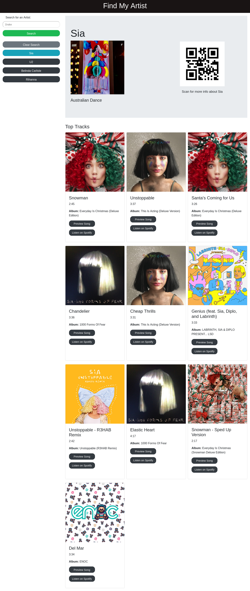
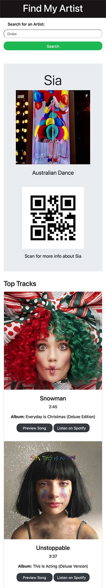

# Find My Artist

This is a song search engine built using:

- Spotify API
- QR code API
- jQuery
- Bootstrap
- HTML
- CSS
- Google Draw
- Kanban Board
- JavaScript

## Group 5 Project 1 (Number Five is Alive)

## The project was developed by a team of 4 people.

- Tamzin Chikhalia
- Stanislav Saner
- Shirley Thompson
- Salisu Isah

## Features

Users can search for songs by entering an artist name.
The search results will display the artist name, the genre if available,
QRcode that takes users to Google search for the artist,
a list of top 10 tracks for the searched artist.

Users have the option to either preview in a modal or listen to the full track on Spotify's app.
The interface is responsive and built using Bootstrap, making it easily accessible on a wide range of devices.

## The URL of the GitHub repository

[Find My Artist Repo](https://github.com/stansaner/song-search-app)

## Link to the Live App

[Find My Artist App](https://stansaner.github.io/song-search-app)

## User Story

AS A music lover with a busy schedule
I WANT to see the top tracks and info about any artist
SO THAT I can keep informed.

## Acceptance Criteria

- Create a music dashboard with form inputs.
- When a user searches for an artist they are presented with information about the artist, and the artist’s top tracks and the artist is added to the search history.
  When a user views the information for that artist they are presented with:
  - The artist’s name
  - The top ten tracks for the artist
  - A thumbnail representing the artist
  - The artist’s genre
  - A QR code that searches the artist in Google

When a user views the top tracks for that artist they are presented with:

- A thumbnail representing the track
- The track name
- Duration of the track
- The album name
- Preview track in modal
- Button to listen to the full track in Spotify app

When a user clicks on an artist in the search history they are again presented with details and top tracks for that artist.

## Usage

To use the song search engine, simply enter the artist name into the search bar and press the 'Search' button or hit 'Enter'.
The search results will be captured in a search history using local storage below the search bar. The search history can be cleared by clicking the 'Clear Search' button.
Scan the QR code using a mobile device to get more information about the artist.
To preview a short clip of the track click on 'Preview Song'.
To listen to the full track on Spotify click on 'Listen on Spotify'.

## Technical details

This search engine makes use of the Spotify Web API to search for artists and their top 10 tracks.
The search for the artist is done in two steps:

- Search for the artist's ID using this API: https://api.spotify.com/v1/search?q=[artist]&type=artist
- Retrieve the artist's data using the previously returned artist's ID by using the API: https://api.spotify.com/v1/artists/[artistID]/top-tracks?market=GB

The app generates the QR code using this API: https://api.api-ninjas.com/v1/qrcode?data=

The front-end of the application is built using HTML, CSS, JavaScript, jQuery, moment.js and Bootstrap. The application is built to be mobile-first and responsive in nature.
We used Github for version control and project management.

The App relies on Spotify's search engine and picks the first item in its returned data.

## Development Process Highlights

The app was developed using Agile methodology. It solves a real-world problem by integrating data received from two server-side API requests.
Using this methode helped us work collaboratively and efficiently.
We have implemented features and bug fixes by using Git branch workflow and pull requests.

## Screenshot of the App

## Mobile view

## Challenges

We had to apply for a spotify developer account to use the API.
In order to access Spotify's data, we needed to generate an access token and implement that into our code.

## Future Work

we plan to add more features such as saving songs to playlists and displaying lyrics
Improving the interface and search results for better user experience
Providing user with options to sort or filter their search results
Implementing an autocomplete feature for search input
Making the application more secure by implementing server-side logic and data encryption.

## Contributors

- Name1 : https://github.com/shirleyama
- Name2 : https://github.com/TamzinC
- Name3 : https://github.com/stansaner
- Name4 : https://github.com/isahsalisu

# License

This project is licensed under the terms of the [MIT] license.

# Acknowledgments

Spotify API documentation and tutorials provided by Spotify
QR code API documentation provided by QR code API provider.
Support and guidance provided by the open-source community.
